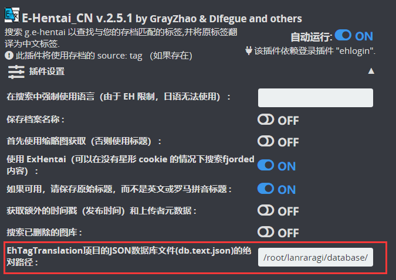
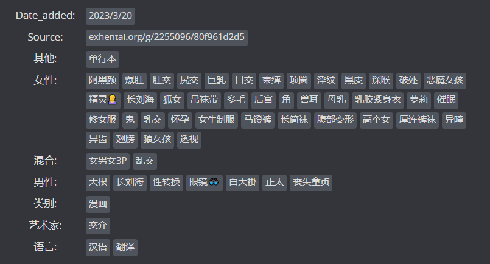

# ETagCN - LANraragi 中文元数据搜刮插件

## 简介
该插件基于Difegue编写的E-Hentai插件进行改良，结合[EhTagTranslation](https://github.com/EhTagTranslation/Database)项目提供的中文标签数据库转换来自E-Hentai上的英文标签。

该插件是[Difegue / LANraragi](https://github.com/Difegue/LANraragi)项目的元数据插件，也适用于[uparrows/LANraragi_cn](https://github.com/uparrows/LANraragi_cn)项目。

该插件是在ChatGPT帮助下开发的(我没有Perl编程基础，只简单了解其基本语法)，所以可能会有不明BUG出现，还请给位见谅。若遇到相关问题可以提交Issues，我会尝试去解决。也欢迎各位大佬帮助完善该插件，谢谢😃

## 使用方法(Docker)
1. 下载插件
2. 上传插件至LANraragi
3. 配置好前置登录插件`E-Hentai`
4. 下载最新的[EhTagTranslation/Database](https://github.com/EhTagTranslation/Database/releases)中文标签数据库`db.text.json`，并放在`LANraragi`镜像的`database`目录下
5. 使用任意文本编辑器打开刚才下载的`db.text.json`，将`重新分类`替换为`类别`
6. 打开该插件配置，找到最后一项
    
    + 官方Docker镜像的用户，路径可填写`/home/koyomi/lanraragi/database/db.text.json`
    + **浅笑一夏**大佬汉化Docker镜像的用户，路径可填写`/root/lanraragi/database/db.text.json`
7. **保存插件配置**

## 预览

## 感谢支持
+ Difegue大佬编写的E-Hentai插件
+ [EhTagTranslation](https://github.com/EhTagTranslation)项目